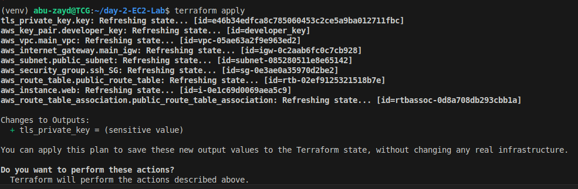
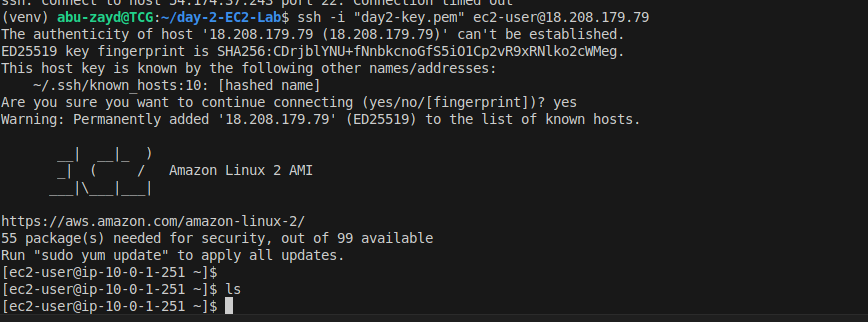

# ☁️ Day 2 - EC2 Deployment Using Terraform

This is a hands-on project from my AWS Terraform learning lab, where I deployed an EC2 instance using **Infrastructure as Code (IaC)**.

## 🛠️ Tools Used
- Terraform
- AWS (EC2, VPC, Key Pair)
- Ubuntu CLI
- Visual Studio Code

## ✅ What I Did
- Wrote a Terraform configuration to:
  - Create a VPC and a subnet
  - Deploy a t2.micro EC2 instance (free tier)
  - Generate an SSH key dynamically using Terraform
  - SSH into the instance using the private key
- All resources were deployed from my local machine 💻

## 🔐 Security
- EC2 security group only allows SSH from my IP.
- Private key never pushed to GitHub 🔒

## 📸 Screenshots

## 🙏 Special Thanks
Big thanks to **Victory Eze** and **Jamiu** for the mentorship during this crash course! 💡

---

🧠 I'm currently on a journey to transition from a **Network Engineer** to a **Cloud Network Engineer**, learning AWS, Terraform, and automation tools step by step.

